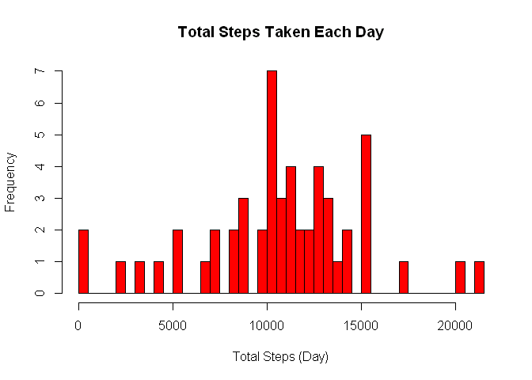
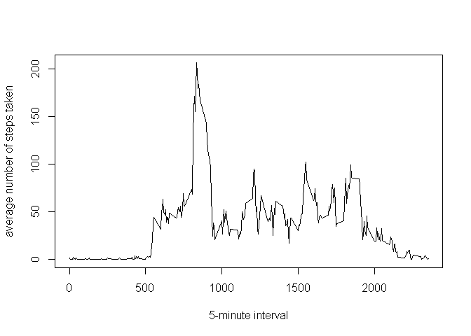
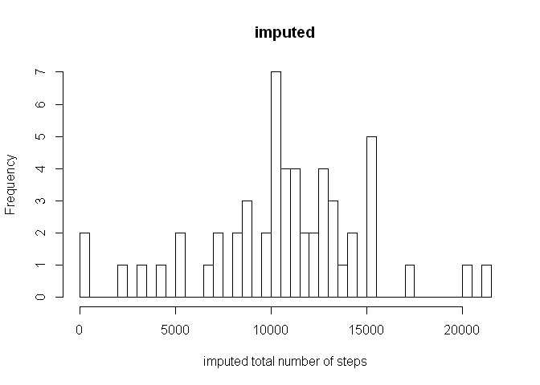
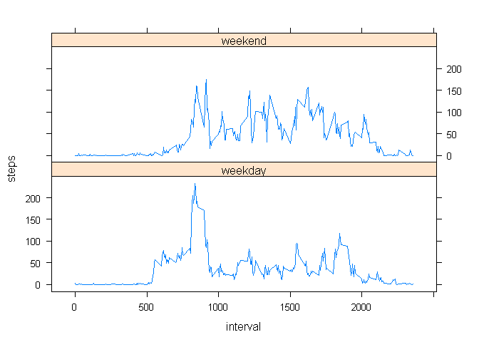

# Reproducible Research: Peer Assessment 1


## Loading and preprocessing the data


```r
activity <-read.csv("activity.csv")
head(activity)
```

```
##   steps       date interval
## 1    NA 2012-10-01        0
## 2    NA 2012-10-01        5
## 3    NA 2012-10-01       10
## 4    NA 2012-10-01       15
## 5    NA 2012-10-01       20
## 6    NA 2012-10-01       25
```

```r
summary(activity)
```

```
##      steps                date          interval     
##  Min.   :  0.00   2012-10-01:  288   Min.   :   0.0  
##  1st Qu.:  0.00   2012-10-02:  288   1st Qu.: 588.8  
##  Median :  0.00   2012-10-03:  288   Median :1177.5  
##  Mean   : 37.38   2012-10-04:  288   Mean   :1177.5  
##  3rd Qu.: 12.00   2012-10-05:  288   3rd Qu.:1766.2  
##  Max.   :806.00   2012-10-06:  288   Max.   :2355.0  
##  NA's   :2304     (Other)   :15840
```

## What is mean total number of steps taken per day?


```r
totalsteps <- aggregate(steps~date, data=activity, FUN=sum)
```

Make Histogram  

```r
hist(totalsteps$steps, 
    col = "red", 
    main = "Total Steps Taken Each Day", 
    xlab="Total Steps (Day)", 
    breaks = nrow(totalsteps))
```

 
 Get mean and median  

```r
meansteps <- mean(totalsteps$steps,na.rm=TRUE, scientific=F)
mediansteps <- median(totalsteps$steps, na.rm=TRUE)
```
The mean is 1.0766189\times 10^{4} and the median is 10765

## What is the average daily activity pattern?


```r
averageDaily <- aggregate(steps~interval, data=activity, FUN=mean)
plot(averageDaily, 
    type = "l", 
    xlab = "5-minute interval", 
    ylab = "average number of steps taken")
```

 

```r
maxStep <- which.max(averageDaily$steps)
```
The 5-minute interval, on average across all the days in the dataset, that contains the maximum number of steps is 104.


## Imputing missing values

Finding number of missing values

```r
missingValues <- sum(is.na(activity))
```
The number of missing values in the data set is 2304

Replacing NAs  

```r
imputedActivity<-activity
imputedActivity[is.na(imputedActivity[, 1]), 1] <-averageDaily[is.na(imputedActivity[, 1]),2]

imputedtotalsteps <- aggregate(steps~date, data=imputedActivity, FUN=sum)
hist(imputedtotalsteps$steps, breaks = nrow(imputedtotalsteps), xlab = "imputed total number of steps", main = "imputed" )
```

 

New mean and median  

```r
imputedmeansteps <- mean(imputedtotalsteps$steps)
imputedmediansteps <- median(imputedtotalsteps$steps)
```

The imputed mean is 1.0766189\times 10^{4} and the imputed median is 1.0765594\times 10^{4}
There was no change to the mean and median  


## Are there differences in activity patterns between weekdays and weekends?

```r
library(lattice)
library(plyr)
weekdays <- weekdays(as.Date(imputedActivity$date))
data_weekdays <- transform(imputedActivity, day=weekdays)
data_weekdays$wk <- ifelse(data_weekdays$day %in% c("Saturday", "Sunday"),"weekend", "weekday")
average_week <- ddply(data_weekdays, .(interval, wk), summarise, steps=mean(steps))

xyplot(steps ~ interval | wk, aggregate(steps ~ interval + wk, data_weekdays, FUN=mean), layout = c(1, 2), type="l")                              
```

 
