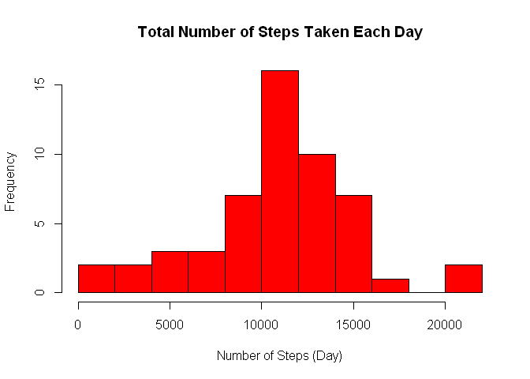
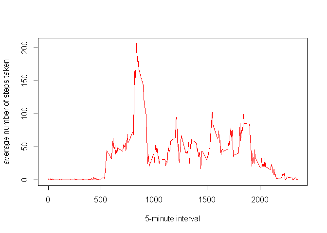
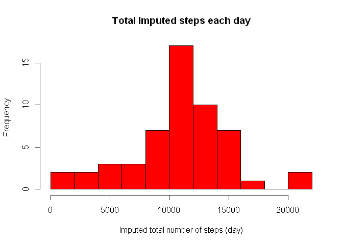
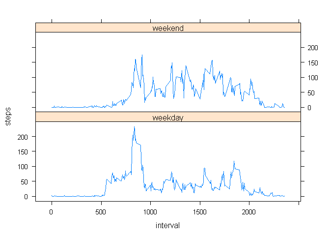

# Reproducible Research: Peer Assessment 1
This is my second attempt at the Reproducible Research MOOC.  
Data was cloned to my working directory using git bash.

### Loading and preprocessing the data


```r
activity <-read.csv("activity.csv")
head(activity)
```

```
##   steps       date interval
## 1    NA 2012-10-01        0
## 2    NA 2012-10-01        5
## 3    NA 2012-10-01       10
## 4    NA 2012-10-01       15
## 5    NA 2012-10-01       20
## 6    NA 2012-10-01       25
```

```r
summary(activity)
```

```
##      steps                date          interval     
##  Min.   :  0.00   2012-10-01:  288   Min.   :   0.0  
##  1st Qu.:  0.00   2012-10-02:  288   1st Qu.: 588.8  
##  Median :  0.00   2012-10-03:  288   Median :1177.5  
##  Mean   : 37.38   2012-10-04:  288   Mean   :1177.5  
##  3rd Qu.: 12.00   2012-10-05:  288   3rd Qu.:1766.2  
##  Max.   :806.00   2012-10-06:  288   Max.   :2355.0  
##  NA's   :2304     (Other)   :15840
```

### What is mean total number of steps taken per day?

- Calculate the total number of steps taken per day
- (ignore the missing values in the dataset)

```r
totalsteps <- aggregate(steps~date, data=activity, FUN=sum, na.rm=TRUE)
```

- Make Histogram of the total number of steps taken each day

```r
hist(totalsteps$steps, 
    col = "red", 
    main = "Total Number of Steps Taken Each Day", 
    xlab="Number of Steps (Day)", 
    breaks = 15)
```

 

- Calculate and report the mean and median of the total number of steps taken 
per day 

```r
meansteps <- mean(totalsteps$steps, na.rm=TRUE, scientific=FALSE)
mediansteps <- median(totalsteps$steps, na.rm=TRUE)
```

The mean total number of steps per day is 1.0766189\times 10^{4} 
The median total number of steps per day is 10765

### What is the average daily activity pattern?
- Make a time series plot of the 5-minute interval (x-axis) and the average 
number of steps taken, averaged across all days (y-axis)


```r
averageDaily <- aggregate(steps~interval, data=activity, FUN=mean)
plot(averageDaily, 
    type = "l", 
    col = "red",
    xlab = "5-minute interval", 
    ylab = "average number of steps taken")
```

 

```r
maxStep <- averageDaily[which.max(averageDaily$steps),]$interval
```

The 5-minute interval, on average across all the days in the dataset, that 
contains the maximum number of steps is 835.

### Imputing missing values
there are a number of days/intervals where there are missing values (NA). 
The presence of missing days may introduce bias into some calculations or 
summaries of the data.

Devise a strategy for filling in all of the missing values in the dataset. 
The strategy does not need to be sophisticated. For example, you could use 
the mean/median for that day, or the mean for that 5-minute interval, etc.

- Calculate and report the total number of missing values in the dataset 
(i.e. the total number of rows with NAs)


```r
missingValues <- sum(is.na(activity))
```

The number of missing values in the data set is 2304

- Create a new dataset that is equal to the original dataset but with the 
missing data filled in.  

```r
imputedActivity<-activity
imputedActivity[is.na(imputedActivity[, 1]), 1] <-averageDaily[is.na(imputedActivity[, 1]),2]
imputedtotalsteps <- aggregate(steps~date, data=imputedActivity, FUN=sum)
```

Make a histogram of the total number of steps taken each day

```r
hist(imputedtotalsteps$steps, 
     col = "red",
     breaks = 15, 
     xlab = "Imputed total number of steps (day)", 
     main = "Total Imputed steps each day" )
```

 

- Calculate and report the mean and median total number of steps taken per day. 

```r
imputedmeansteps <- mean(imputedtotalsteps$steps)
imputedmediansteps <- median(imputedtotalsteps$steps)
```

The imputed mean is 1.0766189\times 10^{4}.
The imputed median is 1.0765594\times 10^{4}.   
There was no change in the values of the mean and median from the first part of 
the assignment.

### Are there differences in activity patterns between weekdays and weekends?

For this part the weekdays() function may be of some help here. 
Use the dataset with the filled-in missing values for this part.

- Create a new factor variable in the dataset with two levels - "weekday" 
and "weekend" indicating whether a given date is a weekday or weekend day.


```r
library(lattice)
library(plyr)
weekdays <- weekdays(as.Date(imputedActivity$date))
data_weekdays <- transform(imputedActivity, day=weekdays)
data_weekdays$wk <- ifelse(data_weekdays$day %in% c("Saturday", "Sunday"),
                           "weekend", "weekday")
average_week <- ddply(data_weekdays, .(interval, wk), summarise, steps=mean(steps))
```

- Make a panel plot containing a time series plot (i.e. type = "l") of the 
5-minute interval (x-axis) and the average number of steps taken, averaged 
across all weekday days or weekend days (y-axis). 

```r
xyplot(steps ~ interval | wk, aggregate(steps ~ interval + wk, data_weekdays, 
                                        FUN=mean), layout = c(1, 2), type="l")                              
```

 

There are differences in activity patterns between the weekdays and the weekend.
The weekends have a flatter profile with higher numbers of more steps taken.
